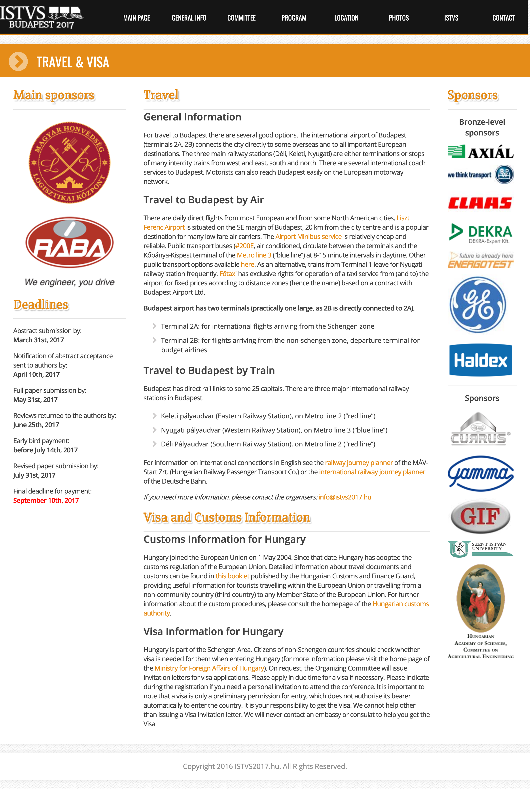

# Travel & Visa


This is a conference site archive. Screenshots of the original website pages below.\
Conference site originally published at [https://istvs2017.hu](https://istvs2017.hu)


### General Information

For travel to Budapest there are several good options. The international airport of Budapest (terminals 2A, 2B) connects the city directly to some overseas and to all important European destinations. The three main railway stations (Déli, Keleti, Nyugati) are either terminations or stops of many intercity trains from west and east, south and north. There are several international coach services to Budapest. Motorists can also reach Budapest easily on the European motorway network.

### Travel to Budapest by Air

There are daily direct flights from most European and from some North American cities. [Liszt Ferenc Airport](http://www.bud.hu/english) is situated on the SE margin of Budapest, 20 km from the city centre and is a popular destination for many low fare air carriers. The [Airport Minibus service](https://www.minibud.hu/en) is relatively cheap and reliable. Public transport buses ([#200E](http://www.bkk.hu/en/timetables/#200E), air conditioned, circulate between the terminals and the Kőbánya-Kispest terminal of the [Metro line 3](http://www.bkk.hu/en/timetables/#M3) (“blue line”) at 8-15 minute intervals in daytime. Other public transport options available [here](http://www.bkk.hu/apps/docs/terkep/repter.pdf). As an alternative, trains from Terminal 1 leave for Nyugati railway station frequently. [Főtaxi](http://www.bud.hu/english/passengers/access\_and\_parking/by\_taxi) has exclusive rights for operation of a taxi service from (and to) the airport for fixed prices according to distance zones (hence the name) based on a contract with Budapest Airport Ltd.

**Budapest airport has two terminals (practically one large, as 2B is directly connected to 2A),**

* Terminal 2A: for international flights arriving from the Schengen zone
* Terminal 2B: for flights arriving from the non-schengen zone, departure terminal for budget airlines

### Travel to Budapest by Train

Budapest has direct rail links to some 25 capitals. There are three major international railway stations in Budapest:

* Keleti pályaudvar (Eastern Railway Station), on Metro line 2 (“red line”)
* Nyugati pályaudvar (Western Railway Station), on Metro line 3 (“blue line”)
* Déli Pályaudvar (Southern Railway Station), on Metro line 2 (“red line”)

For information on international connections in English see the [railway journey planner](https://www.mavcsoport.hu/en) of the MÁV-Start Zrt. (Hungarian Railway Passenger Transport Co.) or the [international railway journey planner](http://reiseauskunft.bahn.de/bin/query.exe/en) of the Deutsche Bahn.

_If you need more information, please contact the organisers:_ info \[at] istvs2017 \[dot] hu

### Visa and Customs Information

### Customs Information for Hungary

Hungary joined the European Union on 1 May 2004. Since that date Hungary has adopted the customs regulation of the European Union. Detailed information about travel documents and customs can be found in [this booklet](http://www.imeko-tc4-2016.hu/wp-content/uploads/2014/02/customs\_and\_other\_rules.pdf) published by the Hungarian Customs and Finance Guard, providing useful information for tourists travelling within the European Union or travelling from a non-community country (third country) to any Member State of the European Union. For further information about the custom procedures, please consult the homepage of the [Hungarian customs authority](http://en.nav.gov.hu/intormation\_on\_customs\_matters/General\_Customs\_Information).

### Visa Information for Hungary

Hungary is part of the Schengen Area. Citizens of non-Schengen countries should check whether visa is needed for them when entering Hungary (for more information please visit the home page of the [Ministry for Foreign Affairs of Hungary](http://konzuliszolgalat.kormany.hu/en)). On request, the Organizing Committee will issue invitation letters for visa applications. Please apply in due time for a visa if necessary. Please indicate during the registration if you need a personal invitation to attend the conference. It is important to note that a visa is only a preliminary permission for entry, which does not authorise its bearer automatically to enter the country. It is your responsibility to get the Visa. We cannot help other than issuing a Visa invitation letter. We will never contact an embassy or consulat to help you get the Visa.

<figure><figcaption></figcaption></figure>
