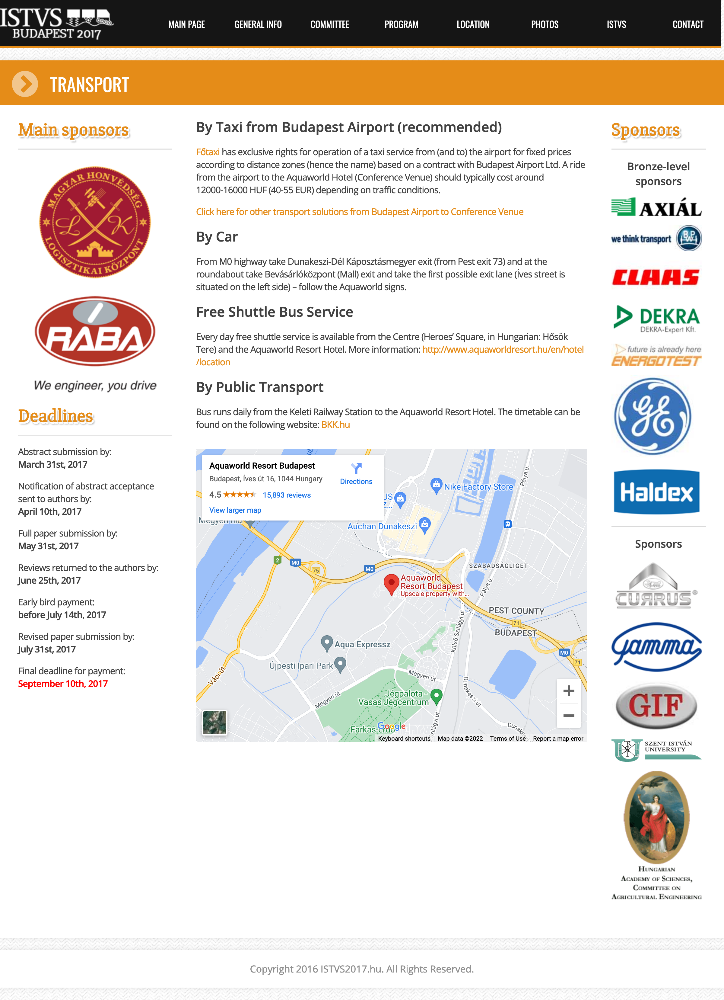

# Transport

### By Taxi from Budapest Airport (recommended)

[Főtaxi](http://www.bud.hu/english/passengers/access\_and\_parking/by\_taxi) has exclusive rights for operation of a taxi service from (and to) the airport for fixed prices according to distance zones (hence the name) based on a contract with Budapest Airport Ltd. A ride from the airport to the Aquaworld Hotel (Conference Venue) should typically cost around 12000-16000 HUF (40-55 EUR) depending on traffic conditions.

[Click here for other transport solutions from Budapest Airport to Conference Venue](https://www.rome2rio.com/s/Budapest-Airport-BUD/K%C3%A1poszt%C3%A1smegyer-Aquaworld)

### By Car

From M0 highway take Dunakeszi-Dél Káposztásmegyer exit (from Pest exit 73) and at the roundabout take Bevásárlóközpont (Mall) exit and take the first possible exit lane (Íves street is situated on the left side) – follow the Aquaworld signs.

### Free Shuttle Bus Service

Every day free shuttle service is available from the Centre (Heroes’ Square, in Hungarian: Hősök Tere) and the Aquaworld Resort Hotel. More information: [http://www.aquaworldresort.hu/en/hotel/location](http://www.aquaworldresort.hu/en/hotel/location)

### By Public Transport

Bus runs daily from the Keleti Railway Station to the Aquaworld Resort Hotel. The timetable can be found on the following website: [BKK.hu](http://www.bkk.hu/en/timetables/#230)

{% embed url="https://www.google.com/maps/embed?pb=!1m14!1m8!1m3!1d10761.370741837143!2d19.106439259015872!3d47.60002594133667!3m2!1i1024!2i768!4f13.1!3m3!1m2!1s0x0%3A0x548a16a2efd67fe7!2sAquaworld+Resort+Budapest!5e0!3m2!1sen!2sus!4v1470743894616" %}

<figure><figcaption></figcaption></figure>
